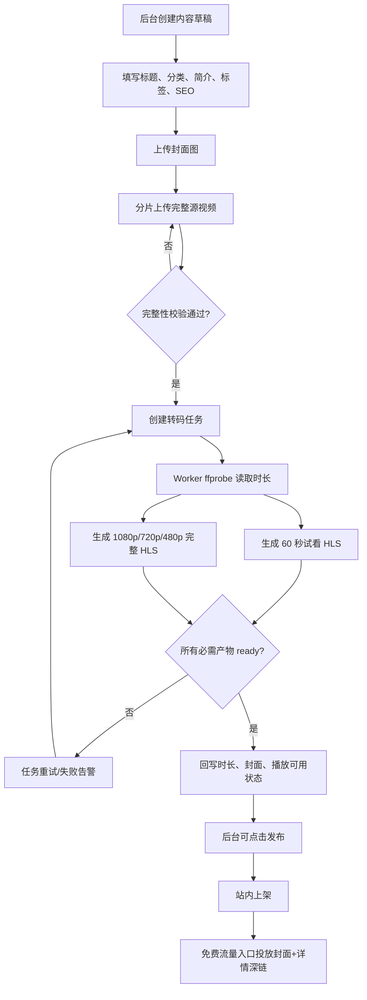
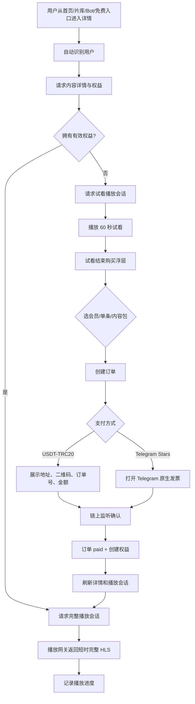
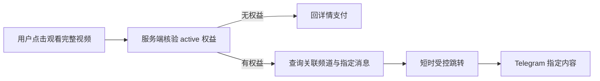
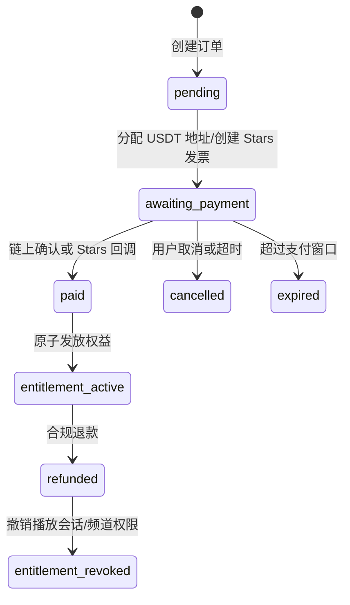

# Samewave VOD 全链路产品与 UI 开发规范

> 版本：V1.0  
> 面向：产品、前端、后端、转码 Worker、测试与运维  
> 核心目标：让成年用户从“看到内容”到“试看、支付、解锁、完整播放、继续观看”始终只有一个明确的下一步。

## 1. 范围与不可变规则

本规范覆盖 H5、PC Web、Telegram Mini App、管理后台、支付、权益、HLS 播放和备用频道交付。

### 1.1 内容生产规则

```text
后台只上传：1 份封面 + 1 份完整源视频
                         ↓
                 转码 Worker 自动生成
       60 秒试看 HLS + 1080p/720p/480p 完整 HLS
                         ↓
                    后台审核发布
```

- 不提供单独“试看视频”上传入口。
- 视频时长由 Worker 的 `ffprobe` 结果回写；未得到时长不得在用户端展示伪造时长。
- 试看必须为完整源视频前 60 秒；源视频不足 60 秒时取完整时长。
- 完整源视频、HLS 切片与对象存储 Key 永不下发给浏览器。

### 1.2 权益规则

| 购买类型 | 解锁范围 | 有效期 | 用户端按钮 |
| --- | --- | --- | --- |
| 月度会员 | 所有已发布的会员内容 | 30 天 | 观看完整视频 |
| 单条解锁 | 当前内容 | 按商品配置，默认永久 | 观看完整视频 |
| 内容包 | 对应内容包内内容 | 按商品配置 | 观看内容包 |

- 有效会员到期前，H5、PC Web、Mini App 必须获得完整播放会话。
- H5 的自动账户与 Telegram 用户不是天然同一账户；绑定同一 Telegram 后必须合并为同一权益主体。
- 支付成功后不可要求用户重新注册、重新登录或手动刷新多次；前端应在收到订单成功后刷新权益和播放会话。

### 1.3 合规与安全规则

- 平台仅面向成年人；内容、标题、标签和推广文案必须清晰表达所有参与者均为成年人。
- 不得允许、推荐或分发涉及未成年人、年龄模糊、非自愿或剥削性内容。
- 不得在 API 响应、页面源码、日志、审计备注中泄露对象存储地址、完整播放源、私密频道邀请或支付密钥。

## 2. 全链路业务流程图

### 2.1 内容上传、转码与发布



发布条件：封面已校验、完整源视频已校验、试看 HLS 已 ready、完整 HLS 全清晰度至少有一档可用。若发布策略要求三档，则 1080p/720p/480p 均 ready 后才可发布。

### 2.2 用户观看、付费与解锁



### 2.3 备用 Telegram 频道交付



频道交付为备用通道；主通道为站内 HLS 播放。

## 3. 订单、支付、权益状态机



### 3.1 支付交互规范

| 环节 | 必须展示 | 禁止展示 |
| --- | --- | --- |
| USDT 收银台 | 商品、金额、TRC-20、地址复制、二维码、订单号、等待状态 | 私钥、地址池策略、内部监听信息 |
| Stars 收银台 | 商品、Stars 金额、Telegram 原生支付入口 | 第三方 provider token |
| 支付成功 | 商品、金额、权益期限、立即观看按钮 | 敏感交易原始数据 |
| 支付失败 | 可理解原因、重试/改用 USDT | 原始数据库或 Telegram 错误正文 |

USDT 订单匹配必须由服务端执行：`网络=TRC-20 + 收款地址 + 指定金额尾数 + 时间窗口 + 未使用交易哈希`。用户端仅轮询订单状态。

## 4. 页面信息架构

### 4.1 移动端与 Mini App

```text
底部四栏
┌────────┬────────┬────────┬────────┐
│ 首页   │ 片库   │ 会员   │ 我的   │
└────────┴────────┴────────┴────────┘

预留：社区、钱包
仅在功能上线后显示；不得以“即将上线”占据主导航位置。
```

### 4.2 PC Web

```text
┌───────────────┬──────────────────────────────────┬───────────────────┐
│ 固定左导航     │ 主内容区                         │ 右侧辅助栏         │
│ 同频           │ 搜索 / Banner / 内容流           │ 会员状态           │
│ 首页           │ 首页：精选、继续观看、最新        │ 上次播放           │
│ 片库           │ 片库：4 列卡片                   │ 待支付订单         │
│ 会员           │ 详情：播放器 + 标题 + 操作       │                   │
│ 我的           │                                  │                   │
└───────────────┴──────────────────────────────────┴───────────────────┘
```

- 左导航桌面宽度固定 `256px`，仅占页面流布局，不得覆盖播放器。
- 内容区域最小宽度 `960px`；大于 `1280px` 时片库强制 4 列。
- 右侧栏 `280px`，窗口不足 `1280px` 时移入主内容末尾。

## 5. UI 数据图与页面规范

### 5.1 设计 Token

| Token | 值 | 用途 |
| --- | --- | --- |
| 页面背景 | `#1F1E28` | 全站基础背景 |
| 卡片背景 | `#2A2738` | 容器与卡片 |
| 主色 | `#B064FF` | 主操作、焦点、选中态 |
| 成功色 | `#63D6A5` | 已解锁、已支付 |
| 警示色 | `#F2B45D` | 未开通、待支付 |
| 主文字 | `#F3EEF9` | 标题与主要信息 |
| 次文字 | `#B9B2C9` | 描述与辅助信息 |
| 桌面页面边距 | `24px` | PC 内容区外边距 |
| 移动页面边距 | `16px` | H5/Mini App 内容区外边距 |
| 卡片圆角 | `16px` | 所有业务卡片 |
| 触控高度 | `48px` | 按钮与可点击行最低高度 |

图片一律使用等比裁切：`object-fit: cover`；容器固定比例，禁止压缩拉伸图片。

### 5.2 首页数据图

```text
移动端首页
┌──────────────────────────────┐
│ 同频                    搜索 通知 │  56px
├──────────────────────────────┤
│ Banner（0–3 张，可横滑）       │  16:9
│ 封面图 + 渐变遮罩 + 标题        │
├──────────────────────────────┤
│ 今日精选                       │
│ ┌──────────────────────────┐ │
│ │ 封面 / 时长 / 标题 / 权益 │ │  16:9
│ └──────────────────────────┘ │
├──────────────────────────────┤
│ 继续观看（有记录才显示）        │
│ [封面] [封面]                  │  2 列
├──────────────────────────────┤
│ 最新上架                 查看全部 │
│ [封面] [封面]                  │  2 列
└──────────────────────────────┘
```

首页规则：

- Logo“同频”、搜索、通知必须同一行。
- 品牌引导语只允许单行、低权重显示，不单独占用大区块。
- Banner 仅支持：`内容详情`、`外部 HTTPS` 两种跳转；最多 3 张。
- 每一张内容卡必须显示封面、时长、标题、权益状态；缺少封面时显示统一占位图，不能空白。

### 5.3 内容详情数据图

```text
┌──────────────────────────────┐
│ ← 视频详情              搜索 通知 │
├──────────────────────────────┤
│ ┌──────────────────────────┐ │
│ │ 封面 / 视频播放器（二选一） │ │ 16:9
│ │ 试看：直接加载试看 HLS     │ │
│ │ 已解锁：直接加载完整 HLS   │ │
│ └──────────────────────────┘ │
│ [会员内容/已解锁]              │
│ 标题                           │
│ 时长 · 分类 · 日期             │
│ 简介（最多三行，可展开）        │
│ 标签                           │
├──────────────────────────────┤
│ 未购：开通会员 / 单条解锁       │
│ 已购：观看完整视频             │
└──────────────────────────────┘
```

详情规则：

- 图片和视频共享同一个 16:9 视觉容器；视频开始后替换封面，不能上下重复占位。
- 未购用户直接自动播放试看；试看结束后，在播放器内部出现半透明购买层。
- 购买层仅展示：权益价值、价格、主按钮、次级“单条解锁”（若可用）。
- 已购用户不得再显示“开通会员”，必须自动加载完整播放会话。

### 5.4 看片库与卡片规范

```text
PC：>= 1280px 固定 4 列
Tablet：768–1279px 3 列
Mobile：< 768px 2 列

卡片
┌──────────────────────┐
│ 16:9 封面            │
│ [时长] [会员/已解锁]  │
├──────────────────────┤
│ 标题（最多 2 行）     │
│ 分类 · 日期           │
│ 价格/权益说明         │
└──────────────────────┘
```

- 分类标签容器必须 `flex-wrap: wrap`；移动端不得横向溢出屏幕。
- 片库卡片高度由内容限制，标题超出两行省略，禁止产生极长窄卡。
- 卡片点击区域为整张卡；购买按钮仅在详情页出现，避免列表每卡都堆叠 CTA。

### 5.5 收银台规范

```text
┌──────────────────────────────┐
│ ← 支付订单                    │
├──────────────────────────────┤
│ 商品：月度会员                │
│ 权益：30 天完整观看            │
│ 应付：9.99 USDT               │
├──────────────────────────────┤
│ 支付方式                       │
│ [USDT-TRC20] [Telegram Stars] │
├──────────────────────────────┤
│ USDT：二维码 + 复制地址        │
│ 订单号 [复制]                  │
│ 等待链上确认…                  │
└──────────────────────────────┘
```

- USDT 仅支持 TRC-20。
- 订单金额、收款地址、二维码必须来自同一个订单接口响应。
- 地址复制按钮必须给出“已复制”反馈；二维码需使用标准 `tron:<address>?amount=<amount>&token=USDT` 内容。
- 成功后显示“权益已发放，立即观看”，并自动返回原详情页。

## 6. 接口契约

### 6.1 用户端

| 接口 | 用途 | 前端关键行为 |
| --- | --- | --- |
| `GET /api/home` | 首页聚合 | 渲染 Banner、精选、继续观看、最新内容 |
| `GET /api/contents/:id` | 详情与权益 | 返回 `durationSeconds`、封面、试看可用、用户权益 |
| `POST /api/contents/:id/playback-session` | 播放会话 | `preview` 或 `full`，永不返回 Bucket URL |
| `POST /api/orders/usdt` | 建 USDT 订单 | 显示订单、地址、金额、二维码 |
| `GET /api/orders/:orderNo/status` | 轮询订单 | `paid` 后刷新权益与播放会话 |
| `POST /api/auth/h5/bind-telegram` | 绑定账户 | 完成后合并权益并刷新页面 |
| `POST /api/watch-progress` | 记录观看进度 | 每 15 秒或暂停时上报 |

### 6.2 管理后台

| 接口能力 | 必须状态 |
| --- | --- |
| 上传封面 | `uploading → verified / failed` |
| 上传完整源视频 | `uploading → verified → transcoding → ready / failed` |
| 发起/重试/取消转码 | 可审计，不能重复创建并发任务 |
| 发布内容 | 必须校验封面、时长、试看与完整产物 |
| 免费流量入口投放 | 发布站内内容后自动创建封面推广任务 |
| 内容发布记录 | 显示渠道、状态、失败类别、重试次数，不展示私密链接 |

## 7. 验收清单

### 7.1 上传与转码

- [ ] 800MB 以上源文件可暂停、刷新、恢复、完成。
- [ ] 完整源视频只需上传一次。
- [ ] Worker 自动写入视频时长。
- [ ] Worker 自动产出 60 秒试看与多档完整 HLS。
- [ ] 转码未完成的内容无法发布；已发布内容转码完成后自动可播放。
- [ ] 失败任务可安全重试，不能重复生成多份可见内容。

### 7.2 观看与支付

- [ ] 未购用户能播放 60 秒试看。
- [ ] 试看结束在播放器内出现购买入口。
- [ ] 有效会员在 H5、PC、Mini App 都获得完整播放。
- [ ] 单条购买仅解锁对应内容。
- [ ] USDT 支付确认后 30 秒内更新订单、权益与页面。
- [ ] H5 绑定 Telegram 后，Mini App 可识别同一权益。
- [ ] 播放地址过期、退款、权益到期后必须 fail-closed。

### 7.3 UI

- [ ] 所有内容卡都有封面、时长、标题和权益状态。
- [ ] 图片不拉伸；统一 16:9 等比裁切。
- [ ] 移动端标题/搜索/通知同一行。
- [ ] 分类自动换行，无横向溢出。
- [ ] PC 片库在 >=1280px 时一行 4 列。
- [ ] 左导航不覆盖播放器或详情内容。

## 8. Trae 交付顺序

1. 修正转码后自动启用播放、时长回写、封面回填。
2. 修正详情页播放器：未购试看、已购完整播放、试看结束购买层。
3. 统一 H5 / Mini App / PC Web 的权益检查与刷新逻辑。
4. 完成 USDT 收银台、订单状态轮询、支付成功自动跳转。
5. 完成首页/片库/详情/我的页面的 Token、响应式栅格与空状态。
6. 完成免费流量入口自动投放和运营渠道可扩展模型。
7. 通过本文件第 7 节全部验收项后再开启大规模投放。

## 9. 术语、角色与唯一口径

本节优先级高于页面文案、旧需求或口头约定；开发中发生冲突时必须按本节实现并在 PR 中标注冲突项。

| 术语 | 唯一含义 | 不包含 |
| --- | --- | --- |
| 内容（Content） | 用户能在首页、片库、详情页看见的一条视频条目 | 源视频文件、频道消息 |
| 视频素材（VideoAsset） | 后台上传的一份完整源视频及其转码关联 | 封面图片 |
| 试看 | 完整源视频从 `00:00` 开始、最长 60 秒的独立 HLS 输出 | 免费频道里的完整视频 |
| 完整播放 | 有权益用户可访问的完整 HLS 输出 | 对象存储的原始文件 |
| 月度会员 | 全站会员内容的 30 天权益 | 内容包、单条永久权益 |
| 单条解锁 | 一个用户对一个内容的独立权益 | 自动获得其他会员内容 |
| 免费流量入口 | 免费频道、Bot、站外社媒等获客渠道 | 会员私密频道 |
| 播放会话 | 由服务端签发、短时有效、绑定用户和内容的播放授权 | 永久播放链接 |

### 9.1 用户身份合并规则

```text
H5/PC 第一次打开：创建 device_user（Cookie）
Telegram Mini App：创建/读取 telegram_user（telegramUserId）
用户在 H5/PC 点击“绑定 Telegram”：
  同一个 Telegram UID 不存在 → 绑定到当前 device_user
  已存在且不是当前用户 → 原子合并订单、权益、播放进度
  合并完成后旧用户不可再作为独立身份继续支付
```

- 每个用户仅有一个不可变 `userId`；随机昵称只是展示字段，不得作为鉴权、订单归属或权益归属依据。
- 同一个 Telegram UID 同时只能绑定一个用户。
- 合并必须使用数据库事务；任一步失败不得出现“订单在 A、权益在 B”的中间状态。
- 合并后仅保留最新有效的昵称与设备记录；订单、权益、观看记录均保留并去重。

## 10. 内容生命周期 PRD

### 10.1 内容状态定义

| 状态 | 后台可见 | 用户端可见 | 可编辑 | 可播放 | 可发布到入口 |
| --- | --- | --- | --- | --- | --- |
| `draft` | 是 | 否 | 是 | 否 | 否 |
| `uploading` | 是 | 否 | 部分字段 | 否 | 否 |
| `transcoding` | 是 | 否 | 文案字段 | 否 | 否 |
| `ready_for_review` | 是 | 否 | 是 | 管理员预览可选 | 否 |
| `published` | 是 | 是 | 受限编辑 | 是 | 是 |
| `unpublished` | 是 | 否 | 是 | 已有会话立即失效 | 否 |
| `failed` | 是 | 否 | 是 | 否 | 否 |

### 10.2 发布前置条件

“发布”按钮只在以下条件同时满足时可点击；不满足时按钮禁用，并逐项展示可理解原因。

| 条件 | 校验主体 | 失败提示 |
| --- | --- | --- |
| 标题 2–80 字 | 前端 + 服务端 | 请填写 2–80 字标题 |
| 分类至少 1 个 | 前端 + 服务端 | 请至少选择一个分类 |
| 封面素材状态 `verified` | 服务端 | 封面仍未校验完成，请重新上传或稍后重试 |
| 完整源视频状态 `verified` | 服务端 | 完整源视频未校验完成 |
| 转码任务状态 `ready` | 服务端 | 正在生成试看与清晰度版本，暂不能发布 |
| 时长 `durationSeconds > 0` | 服务端 | 未读取到视频时长，请重试转码 |
| 试看 HLS `ready` | 服务端 | 试看版本尚未就绪 |
| 完整 HLS 有至少一档 `ready` | 服务端 | 完整播放版本尚未就绪 |
| 成人内容审核声明 | 服务端 | 请确认内容仅涉及成年人且符合平台规则 |

### 10.3 后台上传页面：逐按钮规范

| 区域/按钮 | 前置条件 | 点击后动作 | 成功态 | 失败态 |
| --- | --- | --- | --- | --- |
| 上传封面 | 草稿存在 | 创建封面上传会话并直传对象存储 | 预览图 + `已校验` | 显示“上传失败，可重试”，保留原文件名 |
| 删除封面 | 非已发布，或确认替换 | 删除素材关联，不立即删除历史对象 | 回到封面空状态 | 保留原关联并提示失败 |
| 上传完整源视频 | 草稿存在、无进行中的上传 | 创建 Multipart 会话 | 显示进度、速度、已上传/总大小 | 显示“暂停/继续/重试” |
| 暂停 | 上传中 | 停止发起新分片请求，保存 uploadId/已完成 part | 状态 `paused` | 不允许清空已传分片 |
| 继续 | `paused` 或浏览器刷新后恢复 | 读取已完成 part 并仅上传缺失分片 | 状态 `uploading` | 显示可重试错误类别 |
| 取消上传 | 上传中或暂停 | 调后端 abort；清空本次上传会话 | 可重新选择文件 | abort 失败不影响后台草稿 |
| 开始/重试转码 | 源视频已校验 | 创建或重置一个可重试任务 | `transcoding` | 显示安全错误类别与重试时间 |
| 保存视频信息 | 必填项合法 | 保存元数据与素材关联 | Toast“已保存” | 精确指出字段，不使用“网络错误”笼统提示 |
| 发布 | 满足 10.2 | 内容变为 `published`，创建免费入口任务 | Toast“已发布，正在投放免费入口” | 不改变内容状态 |

### 10.4 转码任务状态与重试

```text
queued → processing → ready
                  ↘ failed_retryable → queued
                  ↘ failed_terminal
```

- 每个内容同一时刻最多有一个 `queued/processing` 转码任务。
- `processing` 超过租约超时后可被安全重新领取；不得同时执行两次。
- 转码成功后必须按顺序原子完成：写入时长 → 标记各 rendition ready → 标记任务 ready → 对已发布内容启用站内播放。
- 任一完整 HLS 产物失败时，内容保持不可发布；不得只发布“封面和标题”。
- 不允许前端自行推测转码完成；一律读取服务端任务状态。

## 11. 用户端页面级 PRD

### 11.1 首页

**目标：** 在一个屏幕内让用户理解“这里有可观看的视频”，并在 1 次点击内进入详情。

| 模块 | 数据来源 | 展示条件 | 行为 | 空状态 |
| --- | --- | --- | --- | --- |
| 顶栏 | 固定 | 始终 | 同频标题；右侧搜索、通知 | 无 |
| Banner | 首页配置 | 1–3 条 | 点击到内容详情或受控外部 HTTPS | 模块完全隐藏 |
| 今日精选 | `featuredContent` | 最多 1 条 | 整卡进入详情 | 隐藏模块，不展示空卡 |
| 继续观看 | `watchProgress` | 有至少 1 条观看记录 | 从上次进度继续 | 隐藏模块 |
| 最新上架 | `latestContents` | 至少 1 条 | 整卡进入详情 | 显示“内容即将上线” |

首页不展示：长篇品牌宣言、分类大列表、多个重复 CTA、未完成模块占位。

### 11.2 片库

| 项目 | 规范 |
| --- | --- |
| 搜索 | 输入后 300ms 防抖；匹配标题、简介、标签；服务端分页 |
| 分类 | 第一行最多展示 6 个；其余收进“更多筛选”；移动端必须换行/横滑二选一，不得裁切 |
| 排序 | 默认最新；可选最受欢迎、精选 |
| 分页 | 移动端上拉加载；PC“加载更多”；不得一次加载全部数据 |
| 卡片 | 见 5.4；无封面时统一占位，严禁黑色空白块 |

### 11.3 内容详情与播放器

播放器状态为唯一真源，前端不得依据按钮文案猜测播放权限。

| 用户状态 | 服务端返回 `access` | 首屏显示 | 点击播放 | 试看结束 |
| --- | --- | --- | --- | --- |
| 未购 | `preview` | 试看播放器 | 立即播放 60 秒 | 打开购买层 |
| 有效会员 | `full` | 完整播放器 | 立即播放完整 HLS | 无购买层 |
| 已单条解锁 | `full` | 完整播放器 | 立即播放完整 HLS | 无购买层 |
| 订单待支付 | `preview + pendingOrder` | 试看播放器 + 继续支付按钮 | 允许试看 | 优先显示继续支付 |
| 转码未完成 | `unavailable` | 封面 + “正在处理” | 禁止播放 | 不显示购买按钮 |
| 内容下架 | `not_found` | 统一下架页 | 禁止播放 | 返回首页 |

试看结束浮层结构：

```text
┌──────────────────────────────────┐
│ 完整内容仅限已解锁用户              │
│ 月度会员：9.99 USDT / 30 天         │
│ [开通会员]                         │
│ [解锁本视频]（仅有单条商品时出现）   │
│ 已有待支付订单？[继续支付]           │
└──────────────────────────────────┘
```

- 播放器封面、试看、完整视频必须共用同一个 16:9 容器。
- 封面加载失败：显示内容标题与统一灰紫渐变占位；不得留黑屏。
- 前端在 `timeupdate` 每 15 秒上报一次进度；暂停、退出页面、播放结束时额外上报一次。
- 上次进度小于 5 秒不展示“继续观看”；离结尾小于 20 秒展示“已看完”。

### 11.4 会员页

| 区域 | 未会员 | 有效会员 | 已过期 |
| --- | --- | --- | --- |
| 顶部状态 | 未开通 | 有效至 YYYY-MM-DD | 已到期 |
| 主按钮 | 9.99 USDT 开通 | 浏览会员内容 | 续费会员 |
| 权益说明 | 月度会员可观看会员内容 | 显示剩余天数 | 说明续费后恢复 |
| 内容推荐 | 推荐会员精选 | 推荐继续观看 | 推荐会员精选 |

### 11.5 我的页

| 区域 | 必须内容 | 禁止内容 |
| --- | --- | --- |
| 账户卡 | 随机昵称、Telegram 绑定状态、设备恢复说明 | “本机账户”等技术术语 |
| 我的权益 | 有效会员、单条权益、到期日 | 私密频道永久链接 |
| 我的订单 | 订单号复制、商品、金额、状态、继续支付 | 收款私钥、链上监听细节 |
| 观看历史 | 封面、标题、进度、继续播放 | 空白封面块 |
| 设置 | 绑定 Telegram、密码、退出当前设备 | 删除订单/权益 |

## 12. 支付与订单详细 PRD

### 12.1 创建订单去重规则

同一用户、同一商品、同一支付方式满足下列条件时，必须复用现有待支付订单，而非重复创建：

```text
状态 = awaiting_payment
且未过期
且商品、用户、支付方式相同
```

页面只显示一个“继续支付”入口。用户主动取消或订单过期后才允许重新建单。

### 12.2 USDT-TRC20 收银台

```text
进入收银台
→ GET 当前订单状态
→ 显示：商品、权益、应付金额、网络、二维码、地址、订单号、倒计时
→ 每 5 秒轮询订单状态；页面可见时轮询，隐藏时暂停
→ paid 后停止轮询，展示成功态，刷新权益，3 秒后返回详情
```

| 字段 | 格式 | 是否可复制 |
| --- | --- | --- |
| 应付金额 | `9.990xxx USDT`；尾数来自订单，不由前端计算 | 是 |
| 网络 | 固定 `TRC-20` | 否 |
| 收款地址 | 完整地址，带复制按钮 | 是 |
| 订单号 | `INT...`，可复制 | 是 |
| 倒计时 | `MM:SS`；到 0 后刷新状态 | 否 |

转账注意事项只保留两条：使用 TRC-20 网络；必须按页面金额转账。不得把多步技术说明压给用户。

### 12.3 支付完成的原子性

```text
监听到候选交易
→ 幂等锁定 transactionHash
→ 匹配订单
→ 标记订单 paid
→ 创建/延长权益
→ 写财务流水与审计
→ 写用户通知
→ 释放播放权限
```

- 重复回调、重复轮询、重复交易通知均不得重复发权益。
- 支付确认失败时，订单不能显示“已支付”。
- 退款时反向处理：订单退款 → 权益撤销 → 立即停止新播放会话 → 写审计；已有播放会话最迟在 5 分钟内失效。

### 12.4 Telegram Stars

- 仅在 Telegram Mini App 内显示 Stars 选项；站外 H5/PC 不显示。
- Stars 金额必须是整数 `XTR`，不混用 USDT 最小单位。
- `openInvoice` 返回失败、取消、pending、paid 必须分别展示不同提示。
- Stars 不可用时保留 USDT-TRC20 选项，不能阻断用户购买。

## 13. 免费流量入口与发布 PRD

### 13.1 统一投放模型

```text
内容 published
→ 自动创建 “免费流量入口推广任务”
→ 目标渠道：免费 Telegram 频道（当前）
→ 未来扩展：Facebook / X / Reddit / 网站落地页
→ 每个渠道独立记录：queued / publishing / sent / failed
```

- 免费流量入口是渠道组，不是内容类型，不要求运营逐个选择已配置的免费频道。
- 已启用的免费 Telegram 频道必须全部收到一条推广消息；失败渠道必须自动重试并可后台单独重试。
- 会员私密频道发布与免费入口推广是两项独立任务，任何一项失败不应重复发送另一项。

### 13.2 免费推广消息字段

| 字段 | 来源 | 规则 |
| --- | --- | --- |
| 封面 | 内容封面 | 16:9；发送图片/封面，不发送完整原视频 |
| 标题 | 内容标题 | 限制 80 字 |
| 简介 | 内容简介 | 0–240 字；必须通过成年人合规审核 |
| 主域名 | 平台配置 | 固定显示 `samewave.cc` 或当前正式主域名 |
| 主按钮/深链 | 内容 ID | Bot `start=content_<id>`，不暴露对象存储地址 |
| 标签 | 内容 SEO/GEO 标签，缺失则平台默认 | 去重、最多 8 个、每个 2–20 字 |

标签格式只允许一行：`#标签1 #标签2 #标签3`。不得生成重复标签、年龄模糊或不合规标签。

## 14. API 响应字段与前端处理

### 14.1 内容卡片 DTO

```ts
type ContentCard = {
  id: string;
  title: string;
  coverUrl: string | null;
  durationSeconds: number | null;
  categoryNames: string[];
  accessLabel: "free_preview" | "membership" | "single_unlocked" | "unavailable";
  publishedAt: string;
};
```

字段规则：

- `coverUrl=null`：前端使用统一占位图；不可拼接对象存储路径。
- `durationSeconds=null`：显示 `处理中`，不可展示 `--:--` 或空黑条。
- `accessLabel=unavailable`：卡片可看详情，但不可播放、不可购买。

### 14.2 播放会话 DTO

```ts
type PlaybackSession = {
  access: "preview" | "full" | "unavailable";
  manifestUrl?: string;
  expiresAt?: string;
  resumeSeconds?: number;
  previewEndsAtSeconds?: number;
  pendingOrderNo?: string;
  unavailableReason?: "transcoding" | "unpublished" | "no_entitlement";
};
```

- `manifestUrl` 必须是平台播放网关 URL，非 S3/Spaces 原始 URL。
- `access=full` 仅可由服务端权益判断产生；前端不得用本地 `isMember` 字段伪造。
- `access=preview` 必须含 `previewEndsAtSeconds`。
- `access=unavailable` 时不创建 `<video>` 请求，防止产生无意义 403/404。

## 15. 失败提示字典

前端统一显示用户可理解的中文；服务端原始错误仅进入安全事件系统。

| 错误类别 | 用户提示 | 可操作按钮 |
| --- | --- | --- |
| `object_storage_unavailable` | 上传服务暂不可用，请稍后重试 | 重试上传 |
| `asset_not_found` | 素材记录已失效，请重新上传后保存 | 重新上传 |
| `transcoding` | 视频正在处理中，完成后即可试看 | 返回内容列表 |
| `no_entitlement` | 开通会员或解锁本视频后即可观看完整内容 | 开通会员 |
| `payment_expired` | 当前支付订单已过期，请重新创建订单 | 重新支付 |
| `payment_pending` | 已检测到待支付订单，可继续完成支付 | 继续支付 |
| `telegram_not_bound` | 绑定 Telegram 后可在 Mini App 使用已有权益 | 绑定 Telegram |
| `network_error` | 网络不稳定，请检查连接后重试 | 重试 |

## 16. 埋点事件字典

所有事件必须带：`eventName`、`eventAt`、`userIdHash`、`platform`、`contentId?`、`sessionId`。不得上传收款地址、完整播放链接、Telegram UID、设备原始指纹。

| 事件 | 触发时机 | 关键属性 |
| --- | --- | --- |
| `home_view` | 首页加载完成 | bannerCount、contentCount |
| `content_impression` | 内容卡进入可视区域 >= 50% 持续 1 秒 | placement、position |
| `content_open` | 打开详情 | from、contentId |
| `preview_start` | 试看实际开始播放 | durationSeconds |
| `preview_complete` | 播放到试看结尾 | watchSeconds |
| `paywall_impression` | 购买层真正展示 | offerTypes |
| `checkout_open` | 打开收银台 | productType、paymentMethod |
| `order_created` | 创建订单成功 | productType、amountBucket |
| `payment_success` | 服务端订单 paid | productType、paymentMethod |
| `full_play_start` | 完整视频实际开始 | quality |
| `playback_buffer` | 卡顿 >= 1 秒 | quality、bufferSeconds |
| `watch_progress` | 进度保存 | progressPercent |
| `membership_renew` | 续费订单成功 | previousExpiryBucket |

## 17. QA 测试用例：必须逐项通过

### 17.1 核心正向链路

1. 新建会员内容，上传封面和 800MB 源视频，刷新页面后可恢复上传。
2. 转码完成后，后台看到时长、试看状态、1080p/720p/480p 状态。
3. 内容发布后，首页精选/最新内容显示正确封面、标题和时长。
4. 未购 H5 用户打开详情，自动开始试看；第 60 秒出现购买层。
5. 月度会员支付成功后，不刷新页面也能切换为完整播放。
6. 同一会员绑定 Telegram 后，在 Mini App 与 PC Web 都可完整播放。
7. 单条解锁用户只能播放该单条内容，其他会员内容仍显示购买层。
8. 有效会员到期后，新建完整播放会话必须拒绝并回到购买层。

### 17.2 异常与幂等

1. 点击“开通会员”两次，只生成/复用一个待支付订单。
2. 链上交易回调重复两次，只发放一次权益。
3. 支付后刷新、关闭再打开页面，权益仍有效。
4. Worker 重启后，已完成的视频不重复转码；处理中任务可安全恢复。
5. 封面上传失败后重新上传，旧 `coverAssetId` 不可阻止保存新封面。
6. 试看 HLS 未 ready 时，前端不可展示可播放按钮。
7. 播放令牌过期后不能继续请求新切片；重新申请会话后可恢复。
8. 退款后，旧播放会话最长 5 分钟失效，新会话立即拒绝。

### 17.3 视觉验收尺寸

| 视口 | 必测页 | 验收重点 |
| --- | --- | --- |
| 375 × 812 | 首页、片库、详情、收银台、我的 | 无横向溢出；底栏不遮挡按钮 |
| 390 × 844 | Mini App 详情与支付 | 头部一行；播放器 16:9 |
| 768 × 1024 | 平板片库与详情 | 卡片 3 列或合理降级 |
| 1280 × 800 | PC 首页、片库 | 片库 4 列；侧栏不盖内容 |
| 1440 × 900 | PC 详情播放页 | 双栏播放器；右侧推荐可见 |

## 18. 开发完成定义（Definition of Done）

每一项功能只有同时满足下列条件才可标为“完成”：

1. 前端、后端、数据库迁移和 Worker 行为均已实现。
2. 至少有 1 条正向测试与 1 条失败/边界测试。
3. 任何失败响应均不含对象存储、数据库、支付、频道或用户敏感信息。
4. PC、H5、Mini App 逐页完成真实浏览器测试，并保留脱敏截图。
5. 接口 DTO 与本文件第 14 节一致；字段改动必须同步修改文档和类型。
6. 代码通过类型检查、构建、全量自动化测试。
7. 合并前由开发者在 PR 中逐项勾选本文件对应验收项；未勾选项不可部署生产。

## 19. 按钮交互、跳转与提示规范

本节为按钮唯一交互表。前端不得因页面不同而改变同名按钮的含义。

### 19.1 全局导航与通用按钮

| 页面 | 按钮 | 点击条件 | 跳转/动作 | 成功反馈 | 异常反馈 |
| --- | --- | --- | --- | --- |
| 全部 | 同频 Logo | 始终 | 回首页并清空筛选 | 无 | 无 |
| 全部 | 搜索 | 始终 | 聚焦搜索框；移动端进入搜索层 | 键盘弹出 | 无 |
| 全部 | 通知 | 已登录/自动账户 | 打开通知抽屉 | 未读清零仅在用户真正查看后发生 | 通知加载失败，可重试 |
| 全部 | 返回 | 有来源页 | 回到来源页面并保留滚动位置 | 无 | 无来源时回首页 |
| 首页 | Banner | 跳转配置有效 | `content` 打开详情；`external` 新窗口/系统浏览器 | 无 | 链接失效，显示“活动已结束” |
| 首页/片库 | 内容卡 | 内容已发布 | 打开内容详情 | 无 | 内容已下架 |
| 全部 | 复制 | 字段可复制 | 写入剪贴板 | “已复制” 1.5 秒 | 请长按复制 |

### 19.2 内容详情页按钮

| 按钮 | 显示条件 | 点击动作 | 服务端校验 | 成功后 UI | 失败提示 |
| --- | --- | --- | --- | --- |
| 播放/暂停 | `access=preview/full` | 控制 video 元素 | 无 | 图标切换 | 当前视频暂不可播放 |
| 开通会员 | 无有效会员且存在会员商品 | `openCheckout(membership)` | 商品 active；用户有效 | 打开支付方式页 | 暂无可购买会员 |
| 解锁本视频 | 单条商品 active 且未解锁 | `openCheckout(single)` | 商品属于该内容；用户未有权益 | 打开支付方式页 | 当前内容暂不支持单条解锁 |
| 继续支付 | 有未过期待支付订单 | 打开该订单收银台 | 订单属于当前用户且未过期 | 恢复倒计时与状态轮询 | 订单已失效，请重新支付 |
| 观看完整视频 | 有有效完整权益 | `createPlaybackSession(full)` | 见 20.2 | 无缝替换为完整流 | 权益状态已变化，请刷新页面 |
| 前往 Telegram 备用观看 | 已有权益且内容配置备用交付 | 请求受控跳转 | 权益 active；资源匹配 | 302/Deep link | 暂无法生成频道入口 |
| 返回 | 始终 | 返回来源位置 | 无 | 无 | 无 |

### 19.3 收银台按钮

| 按钮 | 点击动作 | 禁用条件 | 提示/状态 |
| --- | --- | --- | --- |
| 选择 USDT-TRC20 | 创建或复用 USDT 订单 | 商品无库存/下架；已有效解锁 | 显示“已解锁，无需再次支付” |
| 选择 Telegram Stars | 仅 Mini App 内创建 Stars 发票 | 非 Telegram 上下文；Stars 不可用 | H5/PC：仅展示 USDT；Mini App：改用 USDT |
| 复制收款地址 | 复制订单指定地址 | 地址为空 | “收款地址生成中，请稍后” |
| 复制金额 | 复制订单指定金额 | 金额为空 | “订单信息加载失败” |
| 我已转账/刷新状态 | 立即请求订单状态 | 请求进行中 | 按钮 loading，不重复提交 |
| 取消订单 | 调取消接口 | 已支付/已取消/已过期 | 已取消后返回详情并允许重新购买 |
| 立即观看 | 刷新权益 → 回内容详情 | 权益尚未落库 | “权益发放中，请稍候”，最多轮询 30 秒 |

### 19.4 我的页面按钮

| 按钮 | 动作 | 关键规则 |
| --- | --- | --- |
| 绑定 Telegram | 在安全窗口完成 Telegram 绑定 | 成功后立即调用 `GET /me`、`GET /entitlements`、`GET /orders` 全量刷新 |
| 设置密码 | 设置/修改 H5 恢复密码 | 不得显示原密码；需速率限制与强度校验 |
| 继续播放 | 打开内容详情并携带 `resumeSeconds` | 进度 <5 秒从 0 开始；离结尾 <20 秒显示“重新播放” |
| 查看订单 | 打开订单详情抽屉 | 只允许查看当前用户订单 |
| 继续支付 | 复用未过期订单 | 不得新建第二笔同商品待支付订单 |
| 退出此设备 | 删除本设备会话 Cookie | 不删除订单、权益、Telegram 绑定 |

### 19.5 管理后台关键按钮

| 按钮 | 动作 | 必须二次确认 | 审计事件 |
| --- | --- | --- | --- |
| 保存视频信息 | 保存元数据与素材关系 | 否 | `content.update` |
| 发起转码/重试 | 创建或重试任务 | 重试失败任务时是 | `transcode.enqueue/retry` |
| 发布内容 | 上架内容并创建免费入口任务 | 是，展示目标渠道数量 | `content.publish` |
| 下架内容 | 停止用户端可见与新播放会话 | 是 | `content.unpublish` |
| 重试免费入口投放 | 仅重试失败目标渠道 | 否 | `distribution.retry` |
| 修改会员价格 | 修改未来新订单价格 | 是，展示新旧价格；不得改已创建订单 | `product.price.update` |
| 人工确认支付 | 仅超管、必须填写业务原因 | 是，强制 | `order.manual_paid` |
| 退款 | 仅超管/财务授权角色 | 是，展示权益撤销影响 | `order.refund` |

## 20. 核心判断逻辑与伪代码

### 20.1 首页展示算法

```ts
function buildHome(userId: string | null) {
  return {
    banners: activeBanners
      .filter(b => b.startAt <= now && (!b.endAt || b.endAt > now))
      .sortBy("sortOrder")
      .slice(0, 3),
    featuredContent: publishedContents
      .filter(c => c.isFeatured && c.coverVerified && c.playbackReady)
      .sortBy("featuredOrder", "publishedAt desc")
      .firstOrNull(),
    continueWatching: userId ? recentProgress(userId)
      .filter(p => p.content.published && p.content.playbackReady)
      .slice(0, 3) : [],
    latestContents: publishedContents
      .filter(c => c.coverVerified && c.playbackReady)
      .sortBy("publishedAt desc")
      .slice(0, 6),
  };
}
```

规则：任何内容未具备 `coverVerified && playbackReady` 时，不可进入精选、最新、继续观看模块，避免用户看到无图、无时长、无法播放的卡片。

### 20.2 播放权限算法

```ts
function resolvePlayback(userId: string, contentId: string): PlaybackResult {
  const content = requirePublishedContent(contentId);

  if (!content.platformPlaybackEnabled || !content.hlsReady) {
    return { access: "unavailable", unavailableReason: "transcoding" };
  }

  const activeMembership = hasActiveMembership(userId, now);
  const activeSingle = hasActiveSingleEntitlement(userId, contentId, now);
  const activePackage = hasActivePackageEntitlement(userId, content.packageId, now);
  const fullAllowed = activeMembership || activeSingle || activePackage;

  if (fullAllowed) {
    return issueSession({ userId, contentId, scope: "full", ttlMinutes: 5 });
  }

  if (content.previewReady) {
    return issueSession({
      userId,
      contentId,
      scope: "preview",
      ttlMinutes: 5,
      previewEndsAtSeconds: min(60, content.durationSeconds),
    });
  }

  return { access: "unavailable", unavailableReason: "transcoding" };
}
```

**判定优先级：** 内容下架/不可播放 > 有效权益 > 试看可用 > 处理中。前端不得跳过服务端直接选择完整 URL。

### 20.3 月度会员有效期计算

```ts
function grantMembership(userId: string, paidAt: Date, periodDays = 30) {
  const current = getLatestActiveMembership(userId);
  const base = current && current.expiresAt > paidAt ? current.expiresAt : paidAt;
  return createMembershipEntitlement({
    userId,
    startsAt: paidAt,
    expiresAt: addDays(base, periodDays),
    status: "active",
  });
}
```

- 用户续费时：在现有到期日后增加 30 天，不从付款日截断剩余权益。
- 已到期用户购买时：从支付确认时间起增加 30 天。
- 同一订单只能发放一次；由唯一 `orderId` 约束保证。
- **月度会员当前 USDT 基准价格：9.99 USDT / 30 天。** 订单实际支付金额可含系统分配的极小唯一尾数，支付页必须展示订单指定金额。

### 20.4 创建或复用订单算法

```ts
function getCheckoutOrder(userId: string, productId: string, method: PaymentMethod) {
  if (hasActiveEntitlementForProduct(userId, productId)) {
    return { kind: "already_unlocked" };
  }

  const existing = findOrder({
    userId, productId, method,
    status: ["awaiting_payment"],
    expiresAt: { gt: now },
  });

  if (existing) return { kind: "reuse", order: existing };
  return { kind: "create", order: createPendingOrder(...) };
}
```

### 20.5 USDT 链上匹配算法

```ts
function matchTrc20Transfer(transfer: ChainTransfer) {
  const candidates = orders.where({
    method: "tron_trc20_external",
    status: "awaiting_payment",
    receivingAddress: transfer.to,
    expectedAmountMinor: transfer.amountMinor,
    expiresAt: { gt: transfer.blockTime },
    createdAt: { lte: transfer.blockTime },
  });

  if (candidates.length !== 1) return noMatch();
  if (transactionHashAlreadyUsed(transfer.hash)) return duplicate();
  if (!hasRequiredConfirmations(transfer)) return pending();
  return atomicallyMarkPaid(candidates[0], transfer.hash);
}
```

要求：必须同时匹配网络、地址、金额、订单时间窗和未使用交易哈希；不能只根据金额或用户点击“我已转账”标记成功。

### 20.6 图片与视频比例算法

```css
/* 所有封面/视频预览统一 */
.media-frame {
  aspect-ratio: 16 / 9;
  overflow: hidden;
  background: #2a2738;
}

.media-frame > img,
.media-frame > video {
  width: 100%;
  height: 100%;
  object-fit: cover;
  object-position: center;
  display: block;
}
```

- 图片按短边填满容器，长边等比裁切；绝不压缩变形。
- 视频预览默认 `object-fit: contain` 仅在源视频不是 16:9 且不能裁切内容时使用；详情主播放器优先 `contain`，封面卡片必须 `cover`。
- 图片加载失败事件必须替换为品牌占位，不可保留黑色区域。

## 21. 双 P0 整改：UI 视觉

### 21.1 必须解决的问题

| 问题 | 根因假设 | 强制修复 | 验收标准 |
| --- | --- | --- | --- |
| 内容卡片黑块/无封面 | DTO 空 `coverUrl` 或图片加载失败未兜底 | 统一 `MediaFrame` + placeholder；后端精选过滤无封面内容 | 首页、片库、继续观看 100% 无黑色空封面 |
| 有标题无时长 | Worker 尚未回写或前端未格式化 | 未 ready 不进入用户列表；仅后台展示“处理中” | 已发布用户内容全部显示 `MM:SS` |
| H5 空间浪费 | 重复头部、重复封面与播放器、文案过长 | 单行头部、媒体合并、去除大段品牌区块 | 375px 宽首屏至少展示 Banner + 1 个内容卡 |
| PC 左栏遮挡播放器 | fixed/absolute 层级错误 | 左栏进入 grid 流布局，主区留出列宽 | 1280px 详情页播放器完整可见 |
| 分类溢出 | nowrap 与无上限标签 | 前 6 项 + 更多筛选；`flex-wrap` | 375px 宽无水平滚动条 |
| 字号不一致 | 没有文字 Token | 全局字号表 | 视觉回归截图一致 |

### 21.2 字体、间距与层级硬规则

| 元素 | 移动端 | PC | 行高 | 最大行数 |
| --- | --- | --- | --- |
| 页面标题 | 24px / 700 | 28px / 700 | 1.2 | 1 |
| 区块标题 | 20px / 700 | 22px / 700 | 1.3 | 1 |
| 内容卡标题 | 15px / 600 | 16px / 600 | 1.4 | 2 |
| 正文简介 | 14px / 400 | 15px / 400 | 1.55 | 3 |
| 标签/元信息 | 12px / 500 | 13px / 500 | 1.3 | 1 |
| 主按钮 | 16px / 700 | 16px / 700 | 1 | 1 |

```text
移动端：页面 16px；模块之间 28px；卡片内部 12px；卡片间 12px。
PC：页面 24px；模块之间 32px；卡片内部 16px；卡片间 20px。
```

禁止：同一页面混用超过 3 种标题字号；用大面积文案替代图片；用绝对定位让导航覆盖主内容。

### 21.3 各端布局断点

| 区间 | 页面模式 | 内容卡列数 | 侧栏 |
| --- | --- | --- | --- |
| `< 640px` | H5/Mini App | 2 列 | 底栏；无右侧栏 |
| `640–1023px` | 平板 | 3 列 | 右侧栏下沉到内容末尾 |
| `1024–1279px` | 窄 PC | 3 列 | 左栏 208px；右栏隐藏 |
| `>=1280px` | 标准 PC | 4 列 | 左栏 256px + 右栏 280px |

## 22. 双 P0 整改：支付后与跨端权益逻辑

### 22.1 支付成功后的前端状态更新

```text
订单状态 paid
→ 客户端停止轮询
→ 请求 GET /me（账户绑定状态）
→ 请求 GET /entitlements（权益）
→ 清除 contentId 的播放会话缓存
→ 请求 POST /contents/:id/playback-session
→ access=full：播放器无缝切换完整 HLS
→ 更新“我的”、会员页、详情页、内容卡权益标签
```

不得只更新“支付成功”弹窗而不刷新播放权限；不得要求用户关闭页面重进。

### 22.2 跨端一致性规则

| 场景 | 应有结果 | 产品提示 |
| --- | --- | --- |
| H5 已付费、未绑定 Telegram | H5/PC 可完整播放；Mini App 是独立身份，不能自动看到权益 | 在“我的”显示“绑定 Telegram，在 Mini App 使用已有权益” |
| H5 已付费、已绑定 Telegram | H5/PC/Mini App 都可完整播放 | 不再展示绑定引导 |
| Mini App Stars 付费 | 同 Telegram 用户的 Mini App 立即完整播放；绑定后的 H5/PC 同步 | “权益已同步到已绑定设备” |
| 会员有效期内 | 所有 membership 内容返回 `access=full` | 不展示购买 CTA |
| 会员过期 | 所有 membership 内容回退 `access=preview` | 展示续费 CTA |
| 单条已解锁、无会员 | 仅对应内容 `access=full` | 其他内容正常显示购买 CTA |

### 22.3 权益刷新缓存策略

| 数据 | 缓存时间 | 必须主动失效场景 |
| --- | --- | --- |
| `GET /entitlements` | 最多 60 秒 | 支付成功、绑定 Telegram、退款、主动刷新 |
| 播放会话 | 最多 5 分钟 | 支付成功、退款、内容下架、会话 401 |
| 内容详情 | 最多 60 秒 | 发布/下架、支付成功、转码 ready |
| 首页卡片 | 最多 120 秒 | 新内容发布、封面更新、用户手动下拉刷新 |

任何支付成功回调到达后，必须强制使当前用户的权益缓存失效；不依赖自然过期。

## 23. 新增验收用例：按钮、算法与双 P0

### 23.1 按钮交互

- [ ] 未购用户点击“开通会员”只产生一个待支付订单；连续点击两次仍为同一订单号。
- [ ] 待支付订单点击“继续支付”打开原订单、原金额、原收款地址。
- [ ] 已购用户详情页主按钮为“观看完整视频”，无“开通会员”。
- [ ] 支付成功后“立即观看”在 3 秒内获得 `access=full`，不要求手动刷新。
- [ ] 复制地址、金额、订单号均有成功与失败提示。
- [ ] 下架内容从首页、片库、搜索、继续观看全部移除。

### 23.2 算法与安全

- [ ] 同一链上交易哈希重复回调 10 次，订单/权益/财务流水均只产生 1 次。
- [ ] 会员在第 29 天续费，到期日延长 30 天而非重置为付款日+30 天。
- [ ] 无会员用户永远拿不到完整 HLS manifest。
- [ ] 有会员用户访问任意已发布会员内容均获得 `full`。
- [ ] H5 账户绑定 Telegram 后，原订单、权益、进度被统一到同一用户。
- [ ] 退款后，新完整播放会话立即失败，旧会话在 5 分钟内停止。

### 23.3 UI 视觉

- [ ] 375px、390px、768px、1280px、1440px 截图对比无重叠、裁切、横向滚动。
- [ ] 首页、精选、继续观看、上次播放、片库每张卡都有可见封面或占位图。
- [ ] 所有已发布内容都有格式正确的视频时长；处理中内容不在用户端曝光。
- [ ] PC 1280px 下左导航与播放器无重叠，片库一行 4 列。
- [ ] H5 顶部“同频 / 搜索 / 通知”在单行，底部导航不遮挡内容按钮。
